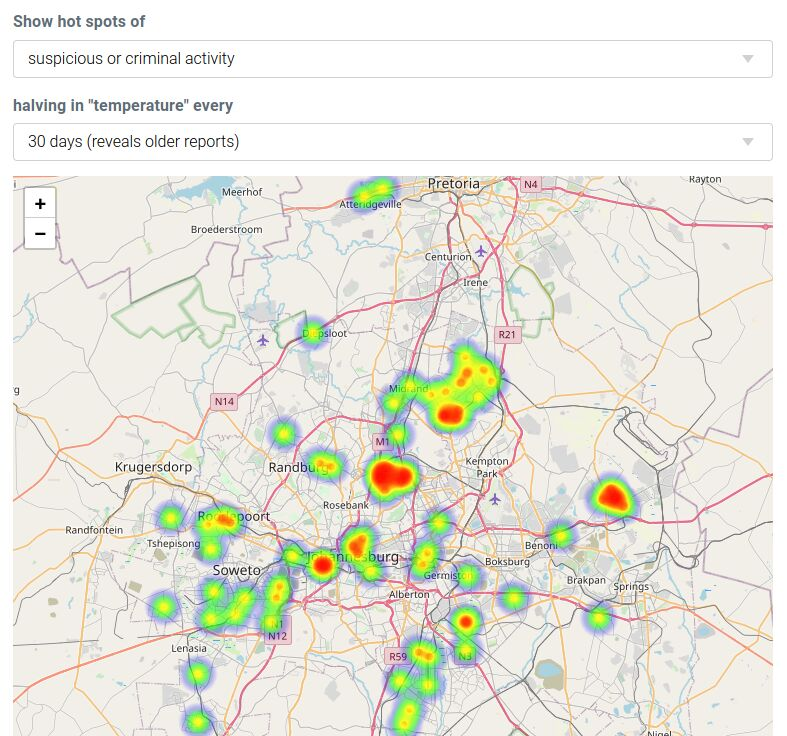

# HotMap

A simple web application targeting mobile devices which produces a crowdsourced
heat map inspired by the widespread unrest in South Africa in July 2021.
Any member of the public can send a report of a threat near their current
location using the form and view the reports of others using the heat map
and tabular listing.

Reports are stored in a PostgreSQL table by the service layer in hotmap.nim.
Because there is no report verification, two measures are present in an
attempt to maintain the heat map's integrity.

1. A reporting device, currently identified by IP address, can only submit
   one report very two hours.
2. The heat map itself relies on a SQL view that weights reports by the number
   of neighbouring (within 200m currently) reports on the assumption that
   legitimate reports will be corroborated by other reporters.

## Building and running

Copy config-example.cfg to config.cfg and edit it for your environment. The
hotmap.nim web service will not launch if it cannot connect to the configured
pg database.

```
nimble install jester
nim c -r hotmap
```


